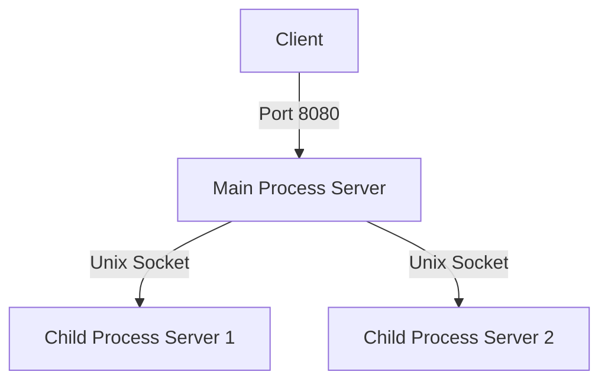

# C Webserver
An HTTP webserver written in C

## Implementation
The current implementation will accept the connection in the "Main Process Server", and then send the connected socket to a child process server to handle the connection.
Child process servers will handle up to 10 connections in a seperate process.



## Coredumps
1. Enabling coredump
```bash
# Set the max coredump size
ulimit -S -c unlimited
# Set the coredump path
sudo sysctl -w kernel.core_pattern=/var/crash/core-%e-%s-%u-%g-%p-%t
```

2. Crash the server
    1. To achieve this for testing, I just added a simple nullptr dereference to handle_request:
    ```c
    int * derefZero = NULL;
    *derefZero = -1;
    ```

    2. Run the server
    ```bash
    ./webserver
    ```

3. Read the coredump file
```bash
gdb ./webserver /var/crash
gef> bt
#0  0x00005654709fdd4e in handle_request (arg=0x5654719ee6b0) at src/webserver.c:85
#1  0x00007f6378020b43 in start_thread (arg=<optimized out>) at ./nptl/pthread_create.c:442
#2  0x00007f63780b2a00 in clone3 () at ../sysdeps/unix/sysv/linux/x86_64/clone3.S:81
```

4. Profit

## RR
0. Install RR
```bash
sudo apt-get install rr
```
1. Add a bug to crash the server
    1. I just added a simple nullptr dereference to handle_request:
    ```c
    int * derefZero = NULL;
    *derefZero = -1;
    ```

    2. Build the server
    ```bash
    make DEBUG=1
    ```
2. Use RR to record the crash
```bash
rr record -n ./webserver
```
3. 
```bash
rr replay
```