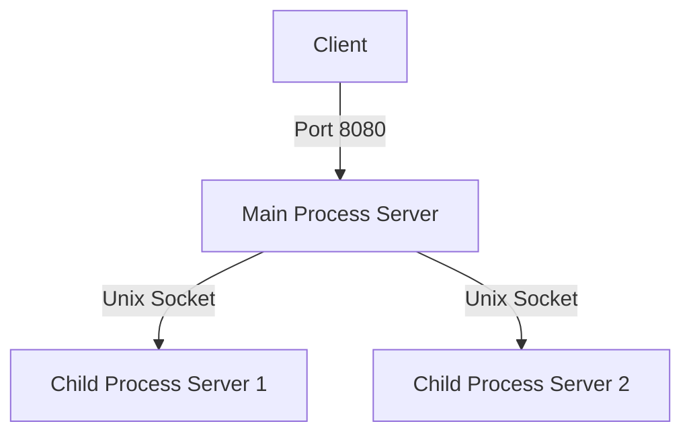

# C Webserver
An HTTP webserver written in C

## Implementation
The current implementation will accept the connection in the "Main Process Server", and then send the connected socket to a child process server to handle the connection.
Child process servers will handle up to 10 connections in a seperate process.



## Coredumps
1. Enabling coredump
```bash
# Set the max coredump size
ulimit -S -c unlimited
# Set the coredump path
sudo sysctl -w kernel.core_pattern=/var/crash/core-%e-%s-%u-%g-%p-%t
```

2. Crash the server
    1. To achieve this for testing, I just added a simple nullptr dereference to handle_request:
        ### **`src: c-webserver/src/webserver.c`**
        ```c
        int * derefZero = NULL;
        *derefZero = -1;
        ```

    2. Run the server
        ```bash
        ./webserver
        ```

3. Read the coredump file
    ```bash
    gdb ./webserver <CORE-FILE>
    # <CORE-FILE> is a path matching `/var/crash/core-%e-%s-%u-%g-%p-%t` due to how we setup coredumps
    gef> bt
    #0  0x00005654709fdd4e in handle_request (arg=0x5654719ee6b0) at src/webserver.c:85
    #1  0x00007f6378020b43 in start_thread (arg=<optimized out>) at ./nptl/pthread_create.c:442
    #2  0x00007f63780b2a00 in clone3 () at ../sysdeps/unix/sysv/linux/x86_64/clone3.S:81
    ```

4. Profit

## RR
1. Setup RR
    1. Install RR
    ```bash
    sudo apt-get install rr
    ```
    2. edit rr.conf
        ### **`src: /etc/sysctl.d/10-rr.conf`**
        ```conf 
        # 
        kernel.perf_event_paranoid = 1
        ```
        - kernel.perf_event_paranoid - TODO: Why?
            ```bash
            rr needs /proc/sys/kernel/perf_event_paranoid <= 1, but it is 2.
            Change it to 1, or use 'rr record -n' (slow).
            Consider putting 'kernel.perf_event_paranoid = 1' in /etc/sysctl.d/10-rr.conf.
            See 'man 8 sysctl', 'man 5 sysctl.d' (systemd systems)
            and 'man 5 sysctl.conf' (non-systemd systems) for more details.
            ```
    3. Reload sysctl
        ```bash
        sudo sysctl --system
        ```

2. Add a bug to crash the server
    1. I just added a simple nullptr dereference to handle_request:
        ```c
        int * derefZero = NULL;
        *derefZero = -1;
        ```

    2. Build the server
        ```bash
        make DEBUG=1
        ```
3. Use RR to record the crash
    ```bash
    rr record ./webserver
    ```
4. Find the process we want to trace
    ```bash
    rr ps
    # an exit code that isn't 0 is more likely to be the crashing process
    ```

5. Load the replay of the crash
    1. Replay the main process
        ```bash
        rr replay
        ```
    2. Replay a child process via fork
        ```bash
        rr replay --onfork=<PID>
        # PID is from `rr ps` from above.
        ```
    3. Replay a child process via exec
        ```bash
        rr replay --onprocess=<PID>
        # PID is from `rr ps` from above.
        ```
6. Watch back the crash with time-travel debugging thanks to `rr`
    ```bash
    # We don't care about sigpipes in most cases
    gef> handle SIGPIPE nostop pass
    # Continue to the crash
    gef> c
    # Run reverse-* commands and other normal GDB commands
    ```
7. Profit

### References:
- https://rr-project.org/
- https://jade.fyi/blog/debugging-rr-children/

## GDB
TODO: Write some instructions about debugging with GDB
```gdb
set detach-on-fork off
info inferiors
info threads
# https://sourceware.org/gdb/onlinedocs/gdb/Forks.html
set follow-fork-mode [child|parent]
show follow-fork-mode
```