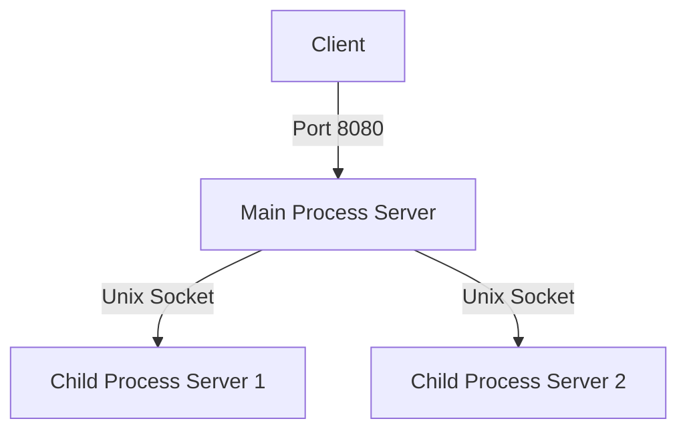

# C Webserver
An HTTP webserver written in C

## Implementation
The current implementation will accept the connection in the "Main Process Server", and then send the connected socket to a child process server to handle the connection.
Child process servers will handle up to 10 connections in a seperate process.

# Links
- [How to use rr](notes/rr.md)
- [How to use coredumps](notes/coredump.md)
- [How to use gdb](notes/gdb.md)